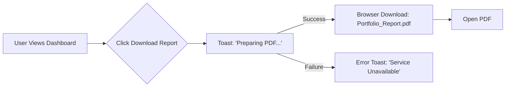
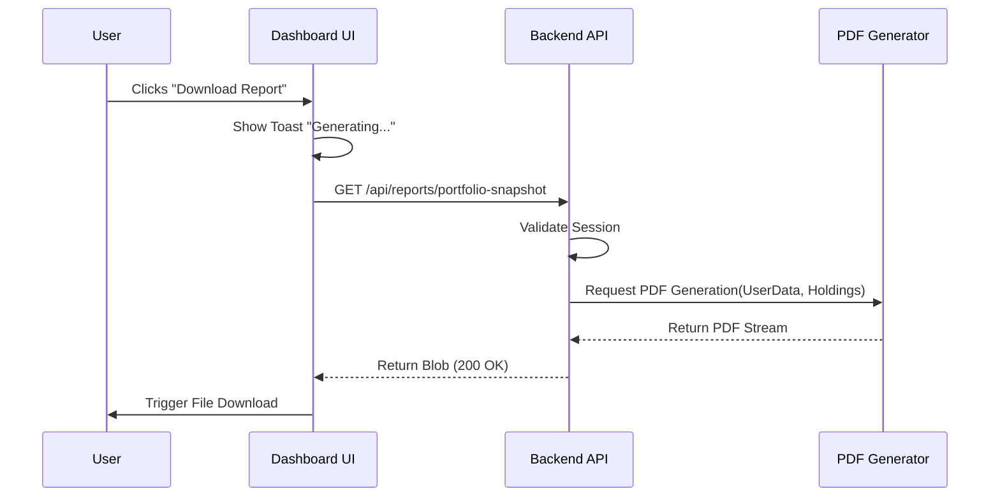
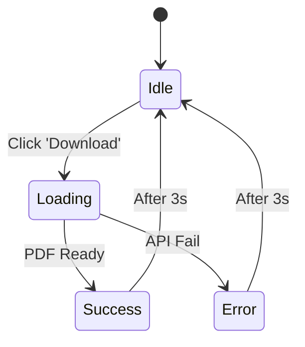
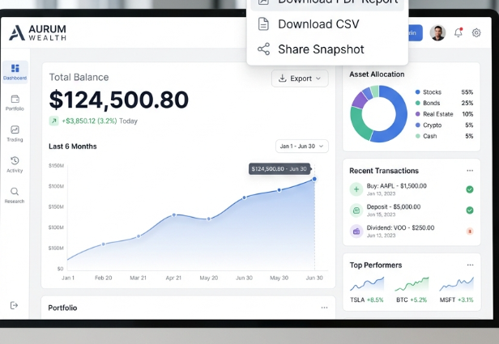

# Product Design Assignment: Portfolio Report Download

**Context**: Response prepared for the Product Designer role at BeyondIrr.
**Scenario**: "Users should be able to download their portfolio report for sharing."

---

## 1. Understanding the Requirement

**What is the stakeholder asking for?**
The stakeholder wants to enable users to generate a static, shareable document (likely PDF) representing their current investment standing. This is not just about "data export" (like CSV for Excel analysis) but about **trust and presentation**. They need a document that looks official enough to serve as proof of wealth.

**Who might use this feature?**
*   **Retail Investors:** To share with a spouse or partner for transparent financial planning.
*   **Loan/Visa Applicants:** To provide "Proof of Funds" to banks, landlords, or embassies who require official stamped documents.
*   **Clients of Advisors:** To share their self-directed portfolio status with a dedicated financial advisor or tax consultant for holistic advice.
*   **Record Keepers:** Users who perform a "monthly close" of their personal finances and want an immutable snapshot.

**Why a user may want it?**
*   **Proof of Funds:** Real-time apps are hard to "print" or cite as official documentation. A generated report with a company logo/watermark provides authority.
*   **Collaboration:** Discussing finances with someone who doesn't have login access (e.g., a spouse) is easier with a printed document than handing over an unlocked phone.
*   **Snapshotting:** Preserving the state of the portfolio at a specific moment in time (e.g., "This was my portfolio allocation *before* the market crash").

---

## 2. Clarifying Questions

Before starting work, I would ask these questions to narrow the scope and identify risks:

1.  **Compliance & Disclaimers:** (Critical in Fintech) Are there specific regulatory disclosures (SEC/SEBI) required when a user shares performance data externally? Do we need a "Not an offer to sell" watermark?
2.  **Format Priority:** Is the primary goal *visual sharing* (PDF) or *data portability* (CSV/Excel)? (I will assume PDF for sharing).
3.  **Privacy:** Should we include a "Privacy Mode" option to generate the report with *allocations only* (hiding actual $ values) for sharing with peers?
4.  **Timeframe:** Is this strictly a "Current Snapshot" (Today) or should users be able to generate a report for a specific past date (e.g., "Statement for FY 23-24")?
5.  **Granularity:** Should the report include a transaction activity log, or just the high-level holdings and performance summary?
6.  **Branding:** Is this white-labeled? Should the user's name be prominent? Can they customize the report title (e.g., "Family Trust Portfolio")?
7.  **Recipient Context:** Are users sharing this internally (with support) or externally? This dictates if we need security features like password protection.
8.  **Distribution:** Is "Download" sufficient, or should we support "Email to myself" or "Send to Advisor" integrations directly?

---

## 3. Defining a Simple First Version (MVP)

For the first version, we should focus on a **Current State Snapshot** PDF that feels premium and official.

**It should definitely include:**
*   **Header:** User Legal Name, Date of Report, and **Company Logo** (for authenticity).
*   **Summary Section:** Total Balance, Total Day Change, and **XIRR/Annualized Return** (if available) to show performance context.
*   **Visuals:** An Asset Allocation Pie Chart (Visuals make the data easier to digest for a secondary reader).
*   **Holdings Table:** List of assets grouped by Asset Class (Stocks, Crypto, Bonds) with Quantity, Current Price, and Total Value.
*   **Trust Markers:** A footer with a "Generated by [Company Name]" timestamp and a unique Request ID for verification.

**One or two assumptions I'm making:**
1.  **PDF only for V1:** We will not support CSV/Excel yet, as "sharing" implies reading, not editing.
2.  **Current data only:** We will not build a complex date-picker UI yet; it always generates the report for "Now".
3.  **No Customization:** Users cannot choose columns or hide specific assets in V1—standards are hardcoded for speed to market.

**User Flow:**



**Technical Sequence (Bonus):**



**Button State Diagram:**



**PDF Layout Wireframe:**

```mermaid
graph TB
    subgraph PDF_Page [PDF Document Page]
        Header(Company Logo | User Name | Date)
        Summary(Total Balance | Day Change | Return %)
        Chart(Asset Allocation Pie Chart)
        Table(Holdings List Table)
        Footer(Disclaimer | Generated By | Request ID)
    end
    
    Header --> Summary
    Summary --> Chart
    Chart --> Table
    Table --> Footer
```

**Basic UI Ideas:**



*   **Entry Point:** In the header of the `SummaryCard` component, place a secondary outline button with a "Download" icon next to the "Last 30 Days" button. It should be unobtrusive but accessible.
*   **Modal/Transition (Optional but nice):** Instead of an immediate download, opening a small modal previewing the report (showing "As of Today" and "Total Value") adds a moment of verification before the file saves.
*   **The Report Design (PDF):** 
    *   **Header:** Clean sans-serif font, Left-aligned User Name, Right-aligned "Powered by [App Name]".
    *   **Colors:** Use the existing brand Primary Blue for headers. Green/Red only for +/-% indicators to avoid visual noise.
    *   **Layout:** Two-column summary at the top (Balance | Return), followed by a full-width pie chart, then the detailed holdings table below.
    *   **Footer:** Small legal disclaimer text in grey at the very bottom.

---

## 4. Acceptance Criteria

These criteria define when the feature is ready for release:

1.  **Visual Integrity:** The PDF layout must not break or overlap text even if the user has 100+ holdings (Pagination must work correctly).
2.  **Data Accuracy:** The "Total Value" in the PDF must match the Dashboard value at the moment of generation within a ±$0.01 variance.
3.  **Mobile Friendly:** The PDF must be legible (font size > 10pt) when viewed on a mobile screen, as many users will share via WhatsApp/iMessage.
4.  **Performance:** The PDF generation must complete in under 5 seconds for a portfolio with < 100 holdings.
5.  **Empty State Handle:** If a user has $0 balance, the report generates correctly with a beneficial "Start Investing" placeholder instead of a broken table.
6.  **Security:** The API endpoint to generate the PDF must validate the session token to ensure users cannot generate reports for other user IDs.

---

## 5. Edge Cases

1.  **Network/API Failure:** If market data is stale or the API is down, the report must fail gracefully with a specific error ("Data unavailable") rather than printing a report with $0.00 values (which could panic a user).
2.  **Large Portfolios:** A user with 500+ individual stock positions might break the page layout. We need to handle table page breaks cleanly, repeating headers on subsequent pages.
3.  **Currency & Localization:** If we support international usage, we must handle different currency symbols (€, ₹, £) and number formatting (1.000,00 vs 1,000.00) correctly based on user locale.
4.  **Dark Mode:** If the user is in Dark Mode on the web, the PDF should *still* generate in Light Mode (standard for printing/documents), unless explicitly requested otherwise.

---

## 6. Measuring Usage

To evaluate if this feature is valuable:

1.  **Adoption Rate:** % of Total Active Users who download a report at least once in a month.
2.  **Viral Loop Potential:** If we add a QR code or "Invest with [Company]" footer, track the **Scan Rate/Referral Traffic** coming from these shared documents.
3.  **Retention Correlation:** Do users who download reports tend to have higher retention rates? (Hypothesis: They are more engaged).
4.  **Purpose tracking:** (Optional) A quick 1-click survey after download: "What is this for? [Loans] [Sharing] [Record Keeping]" to inform V2 features.
